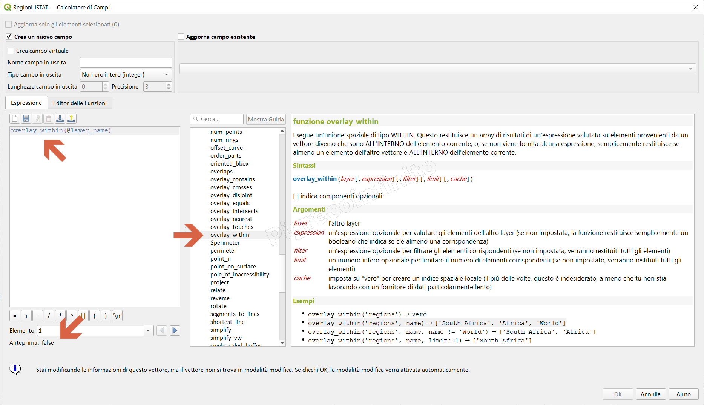

# overlay_within

Restituisce se l'elemento corrente è spazialmente all'interno di almeno un elemento da layer destinazione, o un array di risultati basati su espressione per gli elementi nel layer destinazione che contengono l'elemento corrente. 

Ulteriori informazioni sul sottostante predicato GEOS "Within", come descritto nella funzione PostGIS [ST_WITHIN](https://postgis.net/docs/ST_Within.html).

## Sintassi

overlay_within(_layer[,expression][,filter][,limit][,cache]_)

[ ] indica componenti opzionali

## Argomenti

* _layer_ l'altro layer;
* _expression_ un'espressione opzionale per valutare gli elementi dell'altro layer (se non impostata, la funzione restituisce semplicemente un booleano che indica se c'è almeno una corrispondenza);
* _filter_ un'espressione opzionale per filtrare gli elementi corrispondenti (se non impostata, verranno restituiti tutti gli elementi);
* _limit_ un numero intero opzionale per limitare il numero di elementi corrispondenti (se non impostato, verranno restituiti tutti gli elementi);
* _cache_ imposta su "vero" per creare un indice spaziale locale (il più delle volte, questo è indesiderato, a meno che tu non stia lavorando con un fornitore di dati particolarmente lento);

## Esempi

```
* overlay_within('regions') → true se l'elemento corrente è spazialmente all'interno di una regione
* overlay_within('regions', filter:= population > 10000) → vero se l'elemento corrente è spazialmente all'interno di una regione con una popolazione maggiore di 10000
* overlay_within('regions', name) → un array di nomi, per le regioni contenenti l'elemento corrente
* array_to_string(overlay_within('regions', name)) → una stringa come lista di nomi separati da virgole, per le regioni che contengono l'elemento corrente
* overlay_within('regions', name)[0] → una stringa con il nome della regione che contengono l'elemento corrente
* array_sort(overlay_within(layer:='regions', expression:="name", filter:= population > 10000)) → un array ordinato di nomi, per le regioni contenenti l'elemento corrente e con una popolazione superiore a 10000
* overlay_within(layer:='regions', expression:= geom_to_wkt($geometry), limit:=2) → un array di geometrie (in WKT), per un massimo di due regioni contenenti l'elemento corrente
```



## nota bene

--

## osservazioni

--
