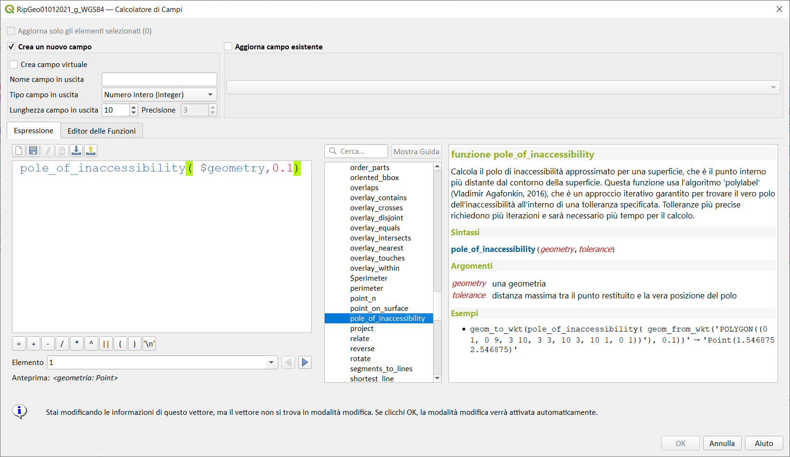

# pole_of_inaccessibility

Calcola il polo dell'inaccessibilità approssimato per una superficie, che è il punto interno più distante dal contorno della superficie. Questa funzione usa l'algoritmo 'polylabel' (Vladimir Agafonkin, 2016), che è un approccio iterativo garantito per trovare il vero polo dell'inaccessibilità all'interno di una tolleranza specificata. Tolleranze più precise richiedono più iterazioni e sarà necessario più tempo per il calcolo.

## Sintassi

pole_of_inaccessibility(_geometry, tolerance_)

## Argomenti

* _geometry_ una geometria
* _tolerance_ distanza massima tra il punto restituito e la vera posizione del polo

## Esempi

* `geom_to_wkt(pole_of_inaccessibility( geom_from_wkt('POLYGON((0 1,0 9,3 10,3 3, 10 3, 10 1, 0 1))'), 0.1)) → 'Point(1.55, 1.55)'`

## nota bene

--

## osservazioni

--

