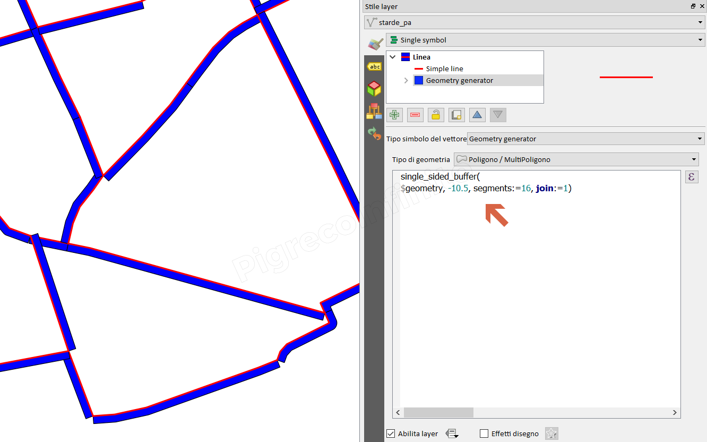

# single_sided_buffer

Restituisce una geometria formata facendo un buffer solo da un lato di una geometria di tipo linestring. Le distanze sono espresse nel SR di tale geometria.

## Sintassi

- single_sided_buffer( _geometry_,  _distance_[,  _segments=8_][,  _join=1_][,  _miter_limit=2.0_])

[ ] indica componenti opzionali

## Argomenti

*  _geometry_ una geometria (multi)linestring
*  _distance_ distanza di buffer. Valori positivi saranno bufferizzati a sinistra delle linee, valori negativi a destra
*  _segments_ numero di segmenti da usare per rappresentare un quarto di cerchio quando è utilizzato uno stile di unione arrotondato. Un numero grande risulta in un buffer più morbido, con più nodi.
*  _join_ stile di unione per gli angoli, dove 1 = arrotondato, 2 = seghettato e 3 = smussato
*  _miter_limit_ limite sul rapporto di seghettatura usato per angoli molto appuntiti (solamente quando si usano le unioni seghettate)

## Esempi

* `single_sided_buffer($geometry, 10.5) → linea bufferizzata a sinistra di 10.5 unità`
* `single_sided_buffer($geometry, -10.5) → linea bufferizzata a destra di 10.5 unità`
* `single_sided_buffer($geometry, 10.5, segments:=16, join:=1) → linea bufferizzata a sinistra di 10.5 unità, usando più segmenti per risultare in un buffer più morbido`
* `single_sided_buffer($geometry, 10.5, join:=3) → linea bufferizzata a sinistra di 10.5 unità, usando un'unione smussata`

## nota bene

--

## osservazioni

--

