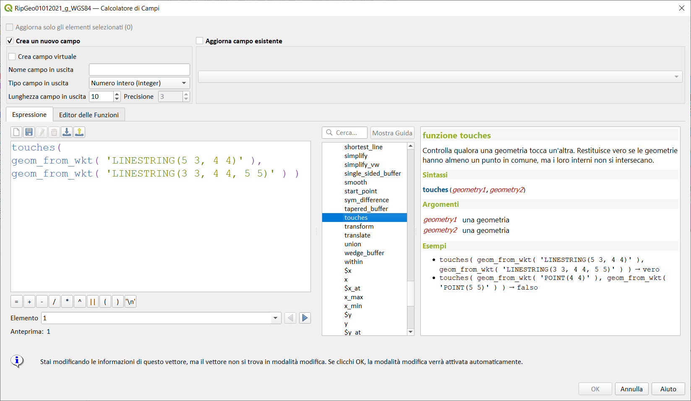
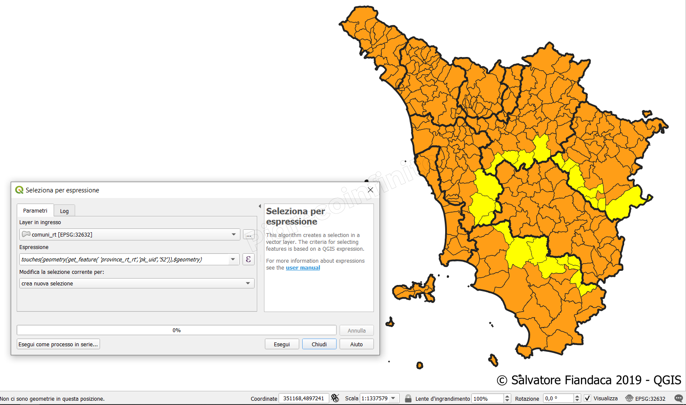

# touches

Verifica se una geometria tocca un'altra. Restituisce vero (1) se le geometrie hanno almeno un punto in comune, ma i loro interni non si intersecano.

## Sintassi

- touches( _geometry1_,  _geometry2_)

## Argomenti

* _geometry1_ una geometria
* _geometry2_ una geometria

## Esempi

* `touches( geom_from_wkt( 'LINESTRING(5 3, 4 4)' ), geom_from_wkt( 'LINESTRING(3 3, 4 4, 5 5)' ) ) → 1`
* `touches( geom_from_wkt( 'POINT(4 4)' ), geom_from_wkt( 'POINT(5 5)' ) ) → 0`

## nota bene

--

## osservazioni

Usando algoritmo `Seleziona per espressione` presente in strumenti di processing oppure  (ctrl+F3):

espressione usata:

`touches(geometry(get_feature( 'province_rt_rt','pk_uid','46')),$geometry)`

dove:

* _geometry1_ è `geometry(get_feature( 'province_rt_rt','pk_uid','52'))`
* _geometry2_ è `$geometry`

seleziono tutti i comuni `touches` (toccati) dalla provincia con `pk_uid`46 (Siena)

**PS:** potrei anche negare (`NOT`) l'espressione per selezionare il complementare (tutti i comuni tranne quelli toccati dalla provincia di Siena).

`NOT touches(geometry(get_feature( 'province_rt_rt','pk_uid','52')),$geometry)`

