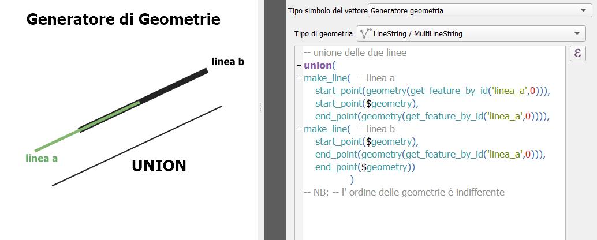
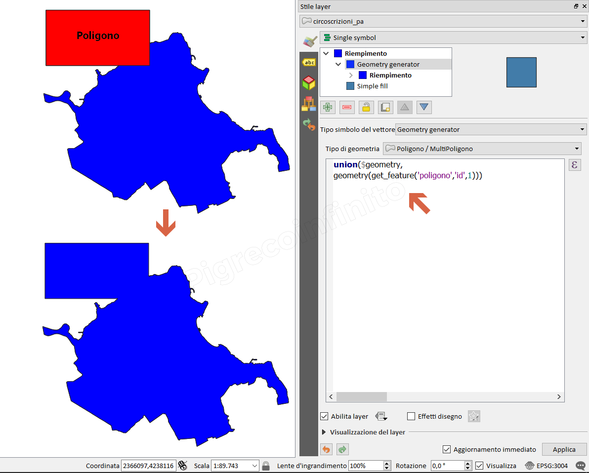

# union

Restituisce una geometria che rappresenta l'insieme dei punti dell'unione delle geometrie.

## Sintassi

- union( _<span style="color:red;">geometry1</span>_,  _<span style="color:red;">geometry2</span>_)

## Argomenti

*  _<span style="color:red;">geometry1</span>_ una geometria
*  _<span style="color:red;">geometry2</span>_ una geometria

## Esempi

* `geom_to_wkt( union( geom_from_wkt( 'POINT(4 4)' ), geom_from_wkt( 'POINT(5 5)' ) ) ) → MULTIPOINT(4 4, 5 5)`




Espressione:

```
-- unione delle due linee
union( 
make_line(  -- linea a
	start_point(geometry(get_feature_by_id('linea_a',0))), 
	start_point($geometry),
	end_point(geometry(get_feature_by_id('linea_a',0)))),
make_line(  -- linea b
	start_point($geometry), 
	end_point(geometry(get_feature_by_id('linea_a',0))),
	end_point($geometry))
				)
-- NB: -- l' ordine delle geometrie è indifferente
```

## prova tu

[Dati e progetto qgz](https://github.com/gbvitrano/HfcQGIS/raw/master/prova_tu/DIFFERENCE.zip)

## nota bene

--

## osservazioni

--


