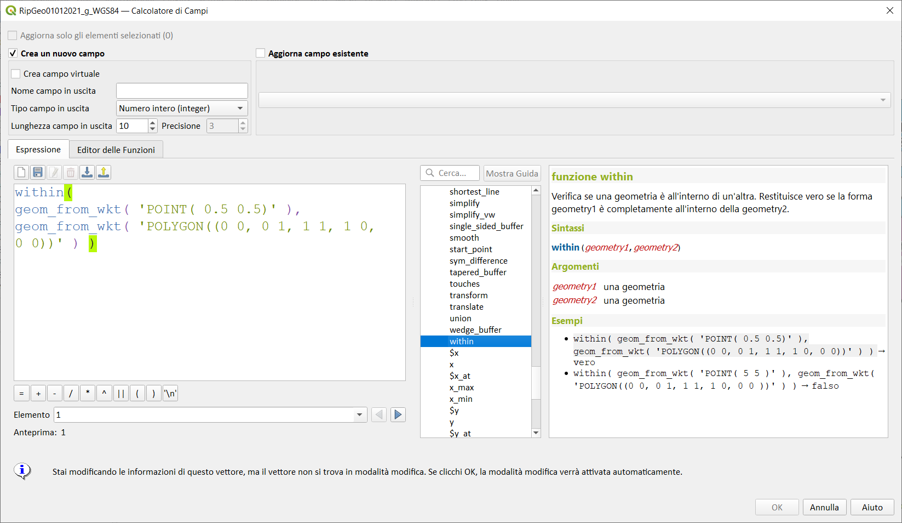
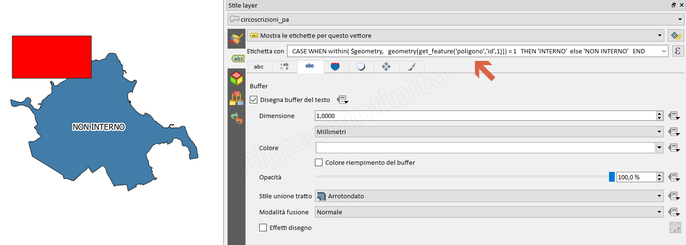

# within

Controlla qualora una geometria sia interna ad un'altra. Restituisce  1 (vero) se la _geometria a_ è completamente contenuta nella_ geometria b_.

## Sintassi

within(_geometry a, geometry b_)

## Argomenti

* _geometry a_ una geometria
* _geometry b_ una geometria

## Esempi

* `within( geom_from_wkt( 'POINT( 0.5 0.5)' ), geom_from_wkt( 'POLYGON((0 0, 0 1, 1 1, 1 0, 0 0))' ) ) → 1`
* `within( geom_from_wkt( 'POINT( 5 5 )' ), geom_from_wkt( 'POLYGON((0 0, 0 1, 1 1, 1 0, 0 0 ))' ) ) → 0`



## nota bene

--

## osservazioni

Usando algoritmo `Seleziona per espressione` presente in strumenti di processing oppure  (ctrl+F3):

espressione usata:

`within($geometry,geometry(get_feature( 'province_rt_rt','pk_uid','53')))`

dove:

* _geometry a_ è `$geometry`
* _geometry b_ è `geometry(get_feature( 'province_rt_rt','pk_uid','53'))`


seleziono tutti i comuni `within` (contenuti) nella provincia con `pk_uid`53 (Grosseto)

**PS:** potrei anche negare (`NOT`) l'espressione per selezionare il complementare (tutti i comuni tranne quelli contenuti nella provincia di Grosseto).

`NOT within($geometry,geometry(get_feature( 'province_rt_rt','pk_uid','53')))`

## Altro esempio con condizione sulle etichette
```
CASE WHEN within( $geometry,
geometry(get_feature('poligono','id',1))) = 1
THEN 'INTERNO'
ELSE 'NON INTERNO'
END
```


