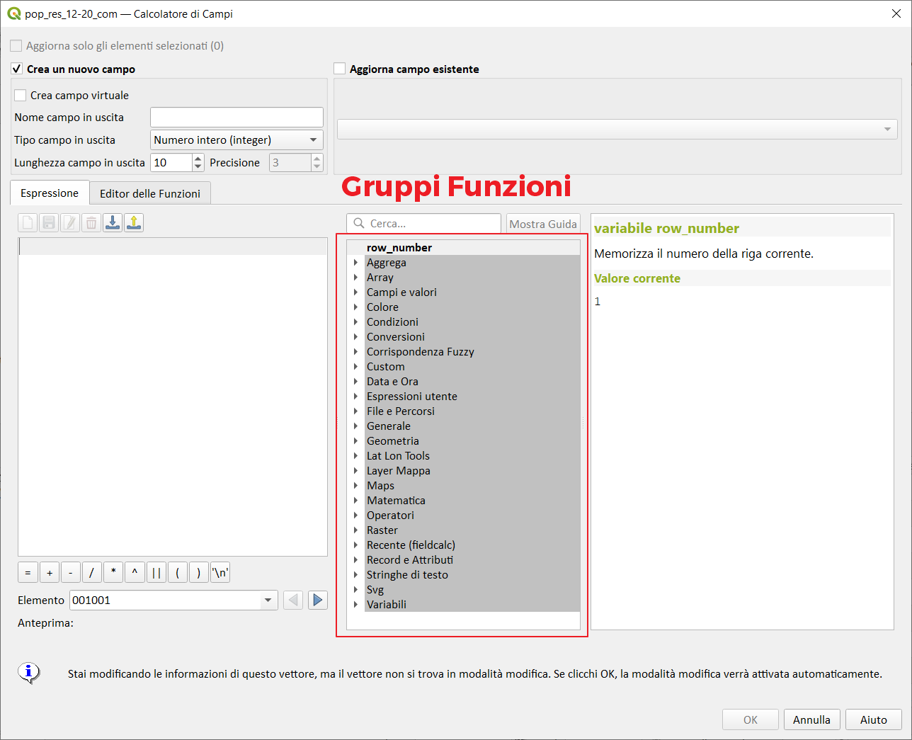

# Gruppi funzioni

Nell'Interfaccia del **Field Calc** (e nel costruttore di espressione) è presente, nella parte centrale, una sezione che raccoglie i Gruppi delle Funzioni elencate sotto:

Gruppo funzioni|nro funzioni*|Descrizione   | info
---------------|:-----------:|--------------|-----
[Aggrega](./aggrega/aggrega_unico.md) |(23/23)|Contiene funzioni che aggregano valori nei livelli e campi.| >= **QGIS 2.16** 
[Array](./array/array_unico.md)| (35/35) |Questo gruppo contiene funzioni espressione per la creazione e la manipolazione di array (noti anche come strutture dati ad elenco). L'ordine dei valori all'interno dell'array è importante, al contrario della struttura dati 'a mappa', in cui l'ordine delle coppie chiave-valore è irrilevante e i valori vengono identificati dalle loro chiavi.|aggiornate a  **QGIS 3.20**
[Campi e valori](./campi_e_valori/campi_unico.md)| (1/1)|Contiene un elenco di campi del layer. Si possono ottenere valori campione con il click del tasto destro del mouse. Seleziona il nome del campo dall'elenco e fai click con il tasto destro per aprire il menù con le opzioni per caricare un campione di valori dal campo selezionato. | Elenco dei campi del layer selezionato
[Colore](./colore/colore_unico.md)| (17/17)|Questo gruppo contiene funzioni per manipolare i colori| Per manipolare i colori
[Condizioni](./condizioni/condizioni_unico.md)| (6/6)|Questo gruppo contiene funzioni per gestire controlli condizionali nelle espressioni.|aggiornate a  **QGIS 3.6**
[Conversioni](./conversioni/conversioni_unico.md)| (15/15)|Questo gruppo contiene funzioni per convertire i dati da un tipo ad un altro, es. da stringa a intero, da intero a stringa.|aggiornate a  **QGIS 3.16**
[Corrispondenza Fuzzy](./corrispondenza_fuzzy/corrispondenza_fuzzy_unico.md)| (4/4)| Questo gruppo contiene funzioni per confronti fuzzy fra valori.|funzioni per confronti fuzzy fra valori
[Custom](./custom/custom_unico.md)| (6/6)| Questo gruppo contiene funzioni Python create in modo personalizzato dall'utente.|funzioni personalizzate
[Data e ora](./data_ora/data_ora_unico.md) |(21/21)|Questo gruppo contiene funzioni per gestire dati con date e ore.|aggiornate a  **QGIS 3.14**
[Espressione utente](./espressione_utente/espressione_utente_unico.md)| (?)|Questo gruppo contiene espressioni memorizzate nel profilo utente.|aggiornate a  **QGIS 3.12**
[File e percorsi](./file_e_percorsi/file_e_percorsi_unico.md)| (8/8)|Contiene funzioni che manipolano nomi di file e di percorsi. manipolano nomi di file e di percorsi
[Generale](./generale/generale_unico.md)| (7/7)|Questo gruppo contiene funzioni generali assortite.| assortimento di funzioni generiche
[Geometria](./geometria/geometria_unico.md) |(124/124)|Questo gruppo contiene funzioni che operano sugli oggetti geometrici es. lunghezza, area.| aggiornate a  **QGIS 3.20**
[Layer mappa](./layer_della_mappa/layer_unico.md)| (2/2)|Contiene una lista dei layer della mappa che sono disponibili nel progetto corrente.| aggiornate a  **QGIS 3.6**
[Layout](./maps/layout_unico.md)| (2/2)|  Visibile solo nel layout di stampa
[Maps](./layer_della_mappa/layer_unico.md)| (2/2) |Questo gruppo contiene funzioni per la creazione e la manipolazione di strutture di dati 'a mappa' (noti anche come oggetti dizionario, coppie chiave-valore o array associative). Si possono assegnare valori a determinate chiavi. L'ordine delle coppie chiave-valore nell'oggetto mappa non è rilevante.|>= **QGIS 3.0** aggiornate a  **QGIS 3.6**
[Matematica](./matematica/matematica_unico.md)| (28/28)|Questo gruppo contiene funzioni matematiche es. radice quadrata, seno e coseno|aggiornate a  **QGIS 3.12**
[Operatori](./operatori/operatori_unico.md)| (23/23)|Questo gruppo contiene operatori es. + - *|aggiornate a  **QGIS 3.20**
[Raster](./rasters/rasters_unico.md)|(2/2)|Contiene funzioni che calcolano statistiche e valori raster.|>= **QGIS 3.4** 
[Recente](./recente/recente_unico.md) |(1/1)| Elenca le ultime 20 espressioni utilizzate
[Record e attributi](./record_e_attributi/record_e_attributi_unico.md)| (13/13)|Questo gruppo contiene funzioni che operano sugli identificativi dei record.|aggiornate a  **QGIS 3.18**
[Relazioni](./relazioni/relazioni_unico.md)| (?)| Visibile solo se ci sono relazioni di progetto
[Stringhe di testo](./stringhe_di_testo/stringhe_di_testo_unico.md)|(23/23)| Questo gruppo contiene le funzioni che operano sulle stringhe es. sostituzione, conversione in maiuscolo.|aggiornate a  **QGIS 3.14**
[Variabili](./variabili/variabili.md) |(4/65+) |Questo gruppo contiene variabili dinamiche che possono essere inserite nelle tue espressioni.|>= **QGIS 2.12** - variano in funzione del contesto

\* i numeri tra parentesi rappresentano: `(numero funzioni documentate / numero funzioni nel gruppo)`