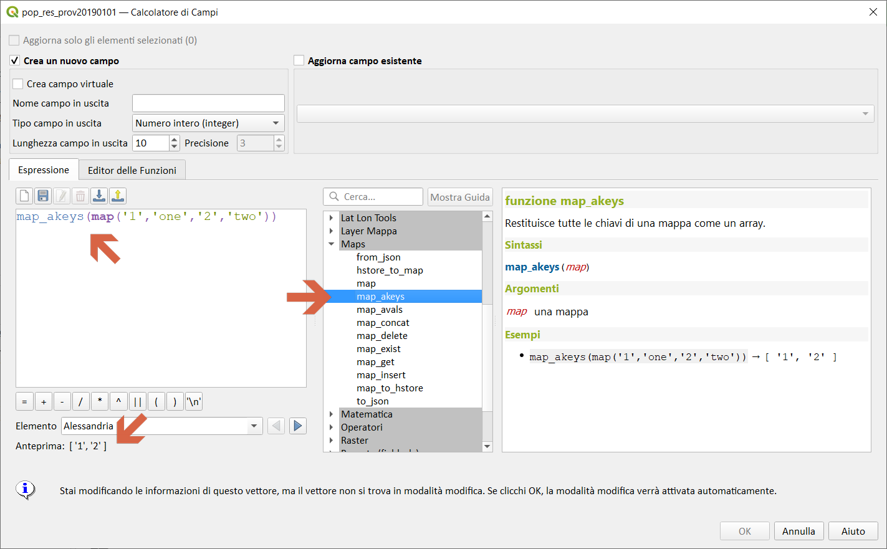
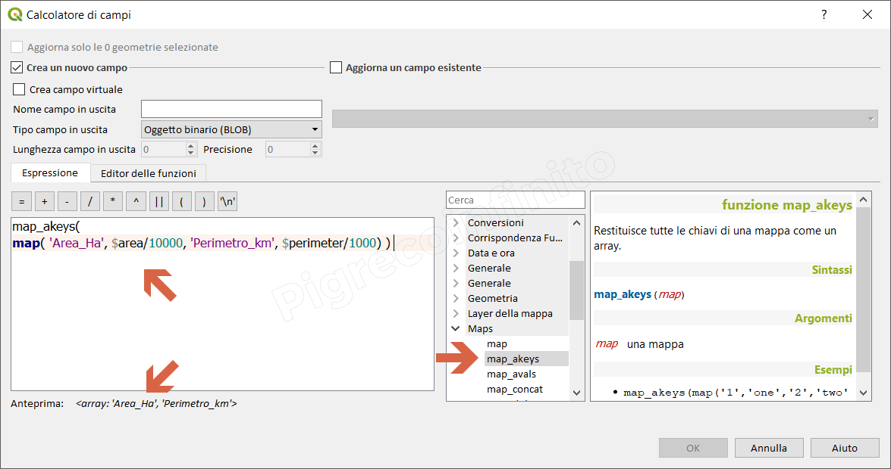

# map_akeys

Restituisce tutte le chiavi di una mappa come un array.

Sintassi:

- map_akeys(_<span style="color:red;">map</span>_)

Argomenti:

* _<span style="color:red;">map</span>_ una mappa

Esempi:

```
map_akeys(map('1','one','2','two')) → array: '1', '2'
```



Altri esempi:



```
 map_akeys( 
 map('Area_Ha',$area/10000,'Perimetro_km',$perimeter/1000)) → ['Area_Ha','Perimetro_km']
```

## Compositore di stampe

`akeys` utilizzabile in ambito compositore stampe per conoscere tutte le variabili disponibili per ogni `Mappa` inserita:


```
wordwrap( array_to_string(  map_akeys(  item_variables( 'Mappa 1') ) ),1,',')
```

risultato della espressione:

```
_project_transform_context
item_id
item_uuid
layer_ids
layers
layout_dpi
layout_name
layout_numpages
layout_page
layout_pageheight
layout_pageoffsets
layout_pagewidth
logo_osgeo4w
map_crs
map_crs_acronym
map_crs_definition
map_crs_description
map_crs_ellipsoid
map_crs_proj4
map_crs_projection
map_crs_wkt
map_end_time
map_extent
map_extent_center
map_extent_height
map_extent_width
map_id
map_interval
map_layer_ids
map_layers
map_rotation
map_scale
map_start_time
map_units
project_abstract
project_area_units
project_author
project_basename
project_creation_date
project_crs
project_crs_acronym
project_crs_definition
project_crs_description
project_crs_ellipsoid
project_crs_proj4
project_crs_wkt
project_distance_units
project_ellipsoid
project_filename
project_folder
project_home
project_identifier
project_keywords
project_last_saved
project_path
project_title
project_units
qgis_locale
qgis_os_name
qgis_platform
qgis_release_name
qgis_short_version
qgis_version
qgis_version_no
user_account_name
user_full_name
```

---
