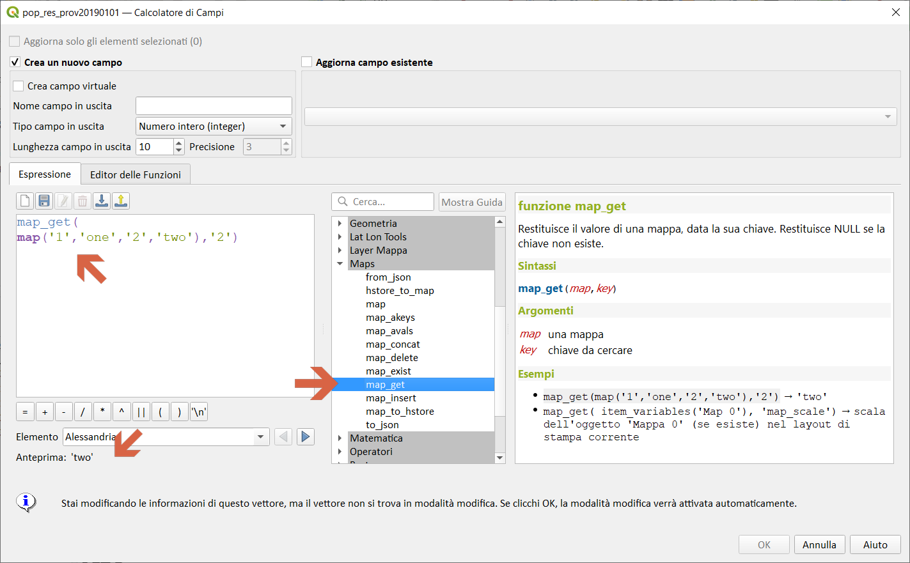
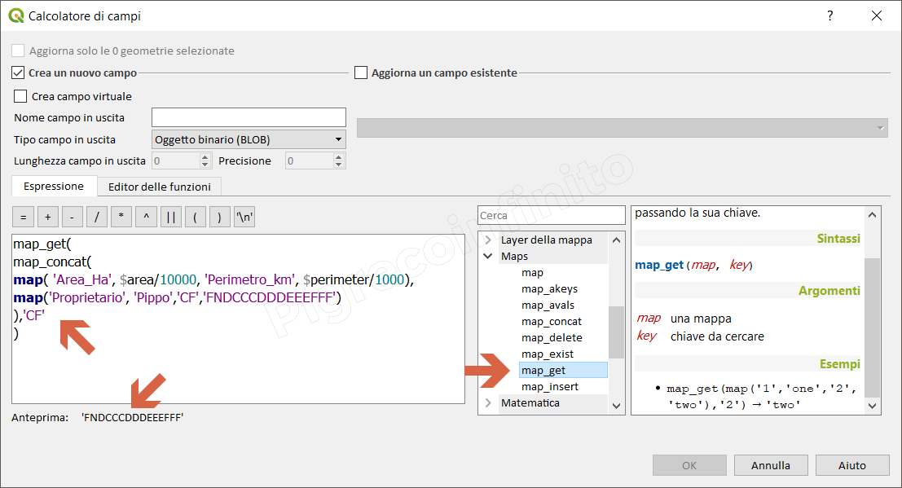
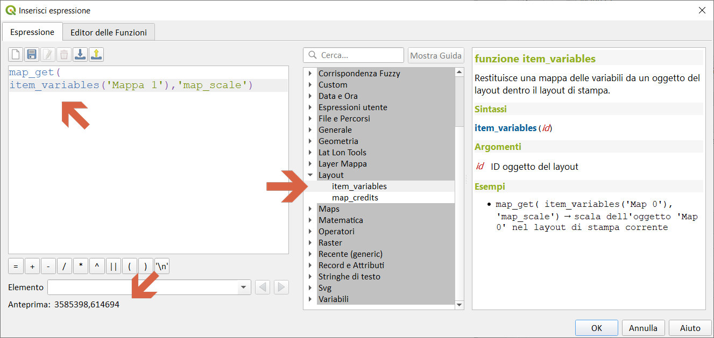

# map_get

Restituisce il valore di una mappa, passando la sua chiave.

## Sintassi

map_get(_map, key_)

## Argomenti

* _map_ una mappa
* _key_ chiave da cercare

## Esempi

* `map_get(map('1','one','2','two'),'2') → 'two'`



## nota bene

--

## osservazioni

--

## Altri esempi



```
map_get(
map_concat(map('Area_Ha',$area/10000,'Perimetro_km',$perimeter/1000)),
map(Proprietario','Pippo','CF','FNDCCCDDDEEEFFF'),'CF') → 'FNDCCCDDDEEEFFF'
```

## Compositore di stampe >= QGIS 3.0



Nuova funzione `item_variables` presente, nel gruppo Layout, solo se utilizzate all'interno di un contesto di composizione.

La funzione accetta un singolo argomento, l'id per un elemento all'interno della composizione e restituisce una mappa del nome della variabile sul valore per quell'elemento. 
Questo ti permette di fare cose come inserire il testo in un'etichetta che recuperi le proprietà di un altro elemento nella composizione, ad es:

Inserisci la scala della mappa in un'etichetta:

* `map_get( item_variables('map'),'map_scale')`

Inserisci la coordinata x del centro della mappa in un'etichetta:

* `x(map_get( item_variables('map'),'map_extent_center'))`

[Changelog QGIS 3.0](https://plugins.qgis.org/plugins/mysqlimport/)

