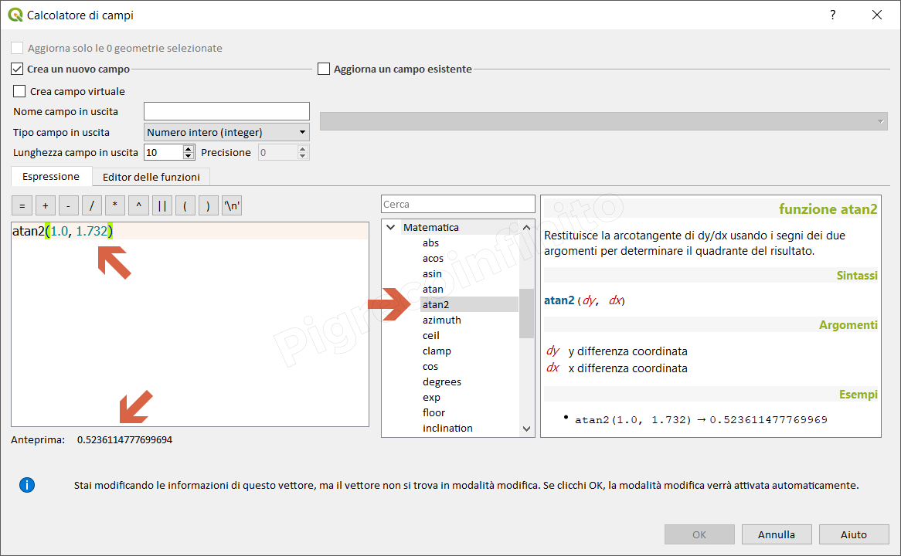
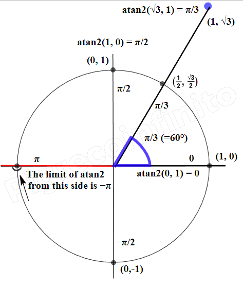
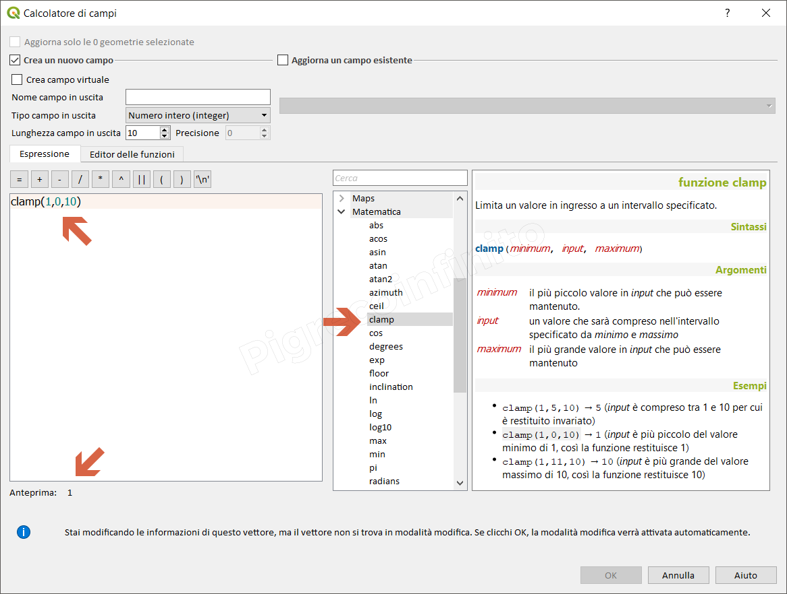
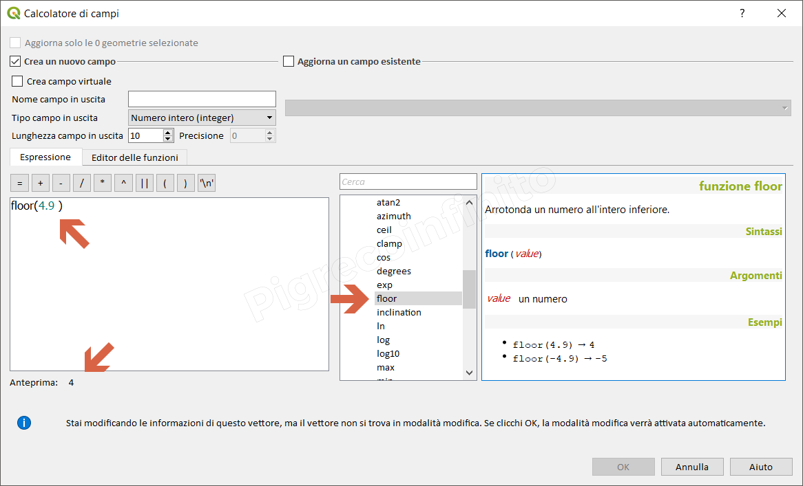
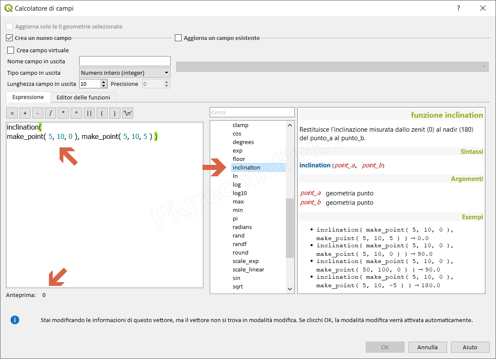
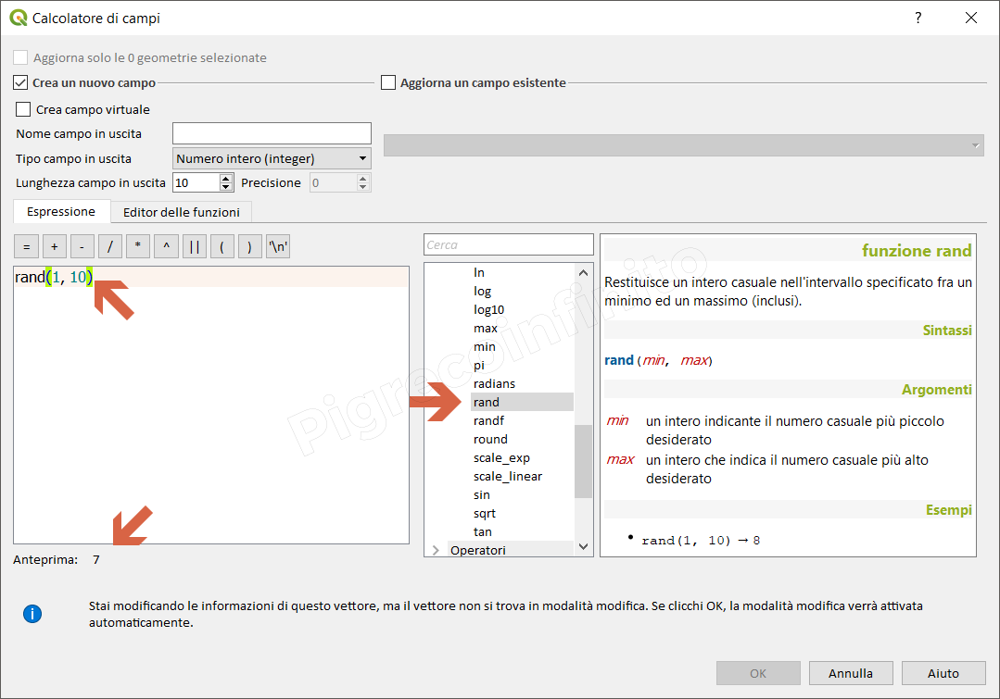
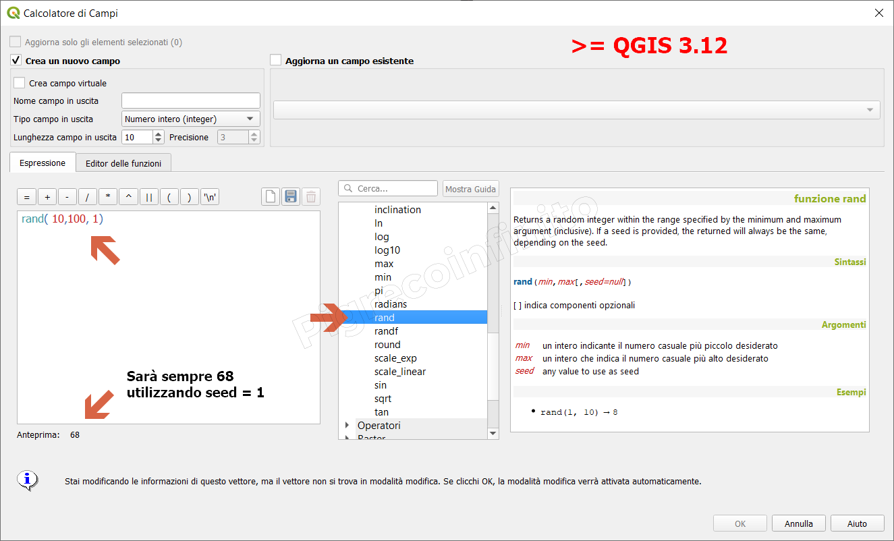
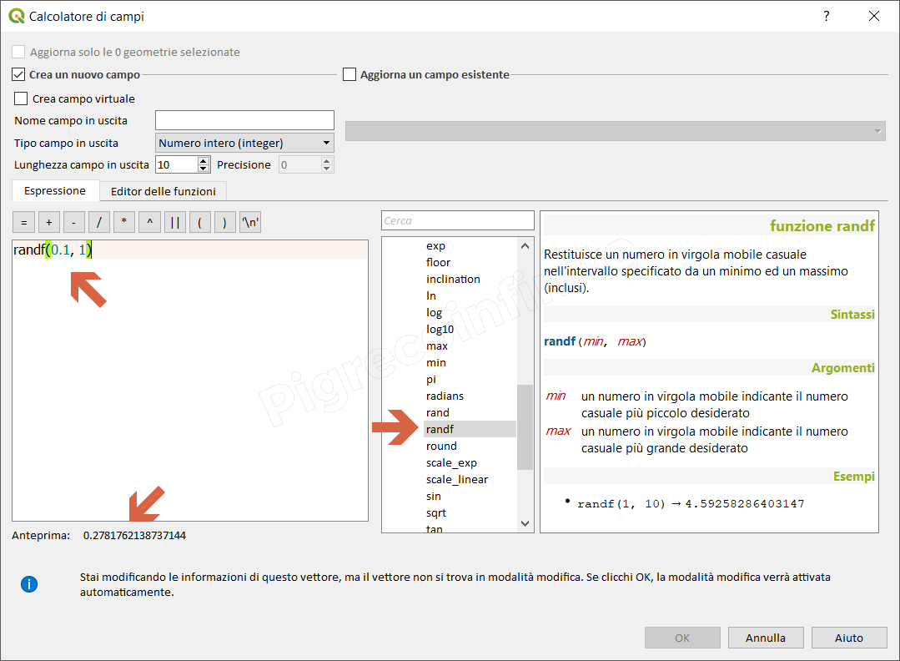
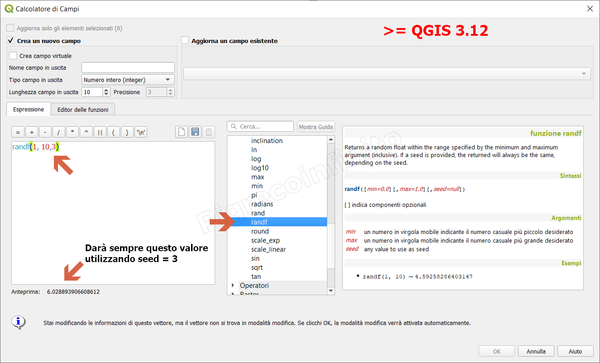

# Gruppo Matematica

!!! Abstract
    **Questo gruppo contiene funzioni matematiche es. radice quadrata, seno e coseno.**

---

## abs

Restituisce il valore assoluto di un numero.

Sintassi:

- abs(_<span style="color:red;">value</span>_)

Argomenti:

- _<span style="color:red;">value</span>_ un numero

Esempi: 

```
abs(-2) → 2
```


---

## acos

Restituisce l'arcocoseno del valore in radianti.

Sintassi:

- acos(_<span style="color:red;">value</span>_)

Argomenti:

* _<span style="color:red;">value</span>_ coseno di un angolo in radianti

Esempi:

```
acos(0.5) → 1.0471975511966
```


---

## asin

Restituisce l'arcoseno del valore in radianti.

Sintassi:

- asin(_<span style="color:red;">value</span>_)

Argomenti:

* _<span style="color:red;">value</span>_ seno di un angolo in radianti

Esempi:

```
asin(1.0) → 1.5707963267949
```


---

## atan

Restituisce l'arcotangente del valore in radianti.

Sintassi:

- atan(_<span style="color:red;">value</span>_)

Argomenti:

* _<span style="color:red;">value</span>_ tangente di un angolo in radianti

Esempi:

```
atan(0.5) → 0.463647609000806
```


---

## atan2

Restituisce la arcotangente di dy/dx usando i segni dei due argomenti per determinare il quadrante del risultato.

Sintassi:

- atan2(_<span style="color:red;">dy</span>, <span style="color:red;">dx</span>_)

Argomenti:

- _<span style="color:red;">dy</span>_ y differenza coordinata
- _<span style="color:red;">dx</span>_ x differenza coordinata

Esempi:

```
atan2(1.0, 1.732) → 0.523611477769969
```





[Wikipedia](https://it.wikipedia.org/wiki/Arcotangente2)

---

## azimuth

Restituisce l'azimut dal nord quale angolo in radianti misurato in senso orario dalla verticale del punto_a al punto_b.

Sintassi:

- azimuth(_<span style="color:red;">point_a</span>, <span style="color:red;">point_b</span>_)

Argomenti:

* _<span style="color:red;">point_a</span>_ geometria punto
* _<span style="color:red;">point_b</span>_ geometria punto

Esempi:

```
degrees( azimuth( make_point(25, 45), make_point(75, 100) ) ) → 42.273689
degrees( azimuth( make_point(75, 100), make_point(25,45) ) ) → 222.273689
```


vedasi nel gruppo funzioni Geometria [Azimuth](../../gr_funzioni/geometria/azimuth.html)

---

## ceil

Arrotonda un numero all'intero superiore.

Sintassi:

- ceil(_<span style="color:red;">value</span>_)

Argomenti:

* _<span style="color:red;">value</span>_ un numero

Esempi:

```
ceil(4.9) → 5
ceil(-4.9) → -4
```


---

## clamp

Limita un valore in ingresso a un intervallo specificato.

Sintassi:

- clamp(_<span style="color:red;">minimum</span>, <span style="color:red;">input</span>, <span style="color:red;">maximum</span>_)

Argomenti:

* _<span style="color:red;">minimum</span>_ il più piccolo valore in input che può essere mantenuto.
* _<span style="color:red;">input</span>_ un valore che sarà compreso nell'intervallo specificato da minimo e massimo
* _<span style="color:red;">maximum</span>_ il più grande valore in input che può essere mantenuto

Esempi:

```
clamp(1,5,10) → 5 (input è compreso tra 1 e 10 per cui è restituito invariato)
clamp(1,0,10) → 1 (input è più piccolo del valore minimo di 1, così la funzione restituisce 1)
clamp(1,11,10) → 10 (input è più grande del valore massimo di 10, così la funzione restituisce 10)
```



---

## cos

Restituisce il coseno di un angolo.

Sintassi:

- cos(_<span style="color:red;">angle</span>_)

Argomenti:

* _<span style="color:red;">angle</span>_ angolo in radianti

Esempi:

```
cos( 1.5707963267948966 )  → 0.0
```


---

## degrees

Converte da radianti a gradi decimali.

Sintassi:

- degrees(_<span style="color:red;">radians</span>_)

Argomenti:

* _<span style="color:red;">radians</span>_ numerico

Esempi:

```
degrees(3.14159) → 179.99984796050427
degrees(1) → 57.2958
degrees(pi()) → 180
```


---

## exp

Restituisce l'esponenziale di un valore.

Sintassi:

- exp(_<span style="color:red;">value</span>_)

Argomenti:

* _<span style="color:red;">value</span>_ numero da restituire come esponente

Esempi:

```
exp(1.0) → 2.71828182845905
```


---

## floor

Arrotonda un numero all'intero inferiore.

Sintassi:

- floor(_<span style="color:red;">value</span>_)

Argomenti:

* _<span style="color:red;">value</span>_ un numero

Esempi:

```
floor(4.9) → 4
floor(-4.9) → -5
```

Esempi:



Vedi esempio [conversione](../../esempi/conversione.html)

---

## Inclination

Restituisce l'inclinazione misurata dallo zenit (0) al nadir (180) del punto_a al punto_b.

Sintassi:

- inclination(_<span style="color:red;">point_a</span>, <span style="color:red;">point_b</span>_)

Argomenti:

* _<span style="color:red;">point_a</span>_ geometria punto
* _<span style="color:red;">point_b</span>_ geometria punto

Esempi:

```
inclination( make_point( 5, 10, 0 ), make_point( 5, 10, 5 ) ) → 0.0
inclination( make_point( 5, 10, 0 ), make_point( 5, 10, 0 ) ) → 90.0
inclination( make_point( 5, 10, 0 ), make_point( 50, 100, 0 ) ) → 90.0
inclination( make_point( 5, 10, 0 ), make_point( 5, 10, -5 ) ) → 180.0
```



vedasi nel gruppo funzioni Geometria [Inclination](../geometria/inclination.html)

## ln

Restituisce il logaritmo naturale di un valore.

Sintassi:

- ln(_<span style="color:red;">value</span>_)

Argomenti:

* _<span style="color:red;">value</span>_ valore numerico

Esempi:

```
ln(1) → 0
ln(2.7182818284590452354) → 1
```


---

## log

Restituisce il valore del logaritmo della base e valore passati.

Sintassi:

- log(_<span style="color:red;">base</span>, <span style="color:red;">value</span>_)

Argomenti:

* _<span style="color:red;">base</span>_ qualsiasi numero positivo
* _<span style="color:red;">value</span>_ qualsiasi numero positivo

Esempi:

```
log(2, 32) → 5
log(0.5, 32) → -5
log(2.7182818284590452354, 1) = ln(1) → 1
```


---

## log10

Restituisce il valore del logaritmo in base10 dell'espressione passata.

Sintassi:

- log10(_<span style="color:red;">value</span>_)

Argomenti:

* _<span style="color:red;">value</span>_ qualsiasi numero positivo

Esempi:

```
log10(1) → 0
log10(100) → 2
```


---

## max

Restituisce il valore maggiore di un insieme di valori.

Sintassi:

- max(_<span style="color:red;">value1</span>, <span style="color:red;">value2<span style="color:red;">, <span style="color:red;">…</span>_)

Argomenti:

* _<span style="color:red;">value</span>_ un numero

Esempi:

```
max(2,10.2,5.5) → 10.2
max(20.5,NULL,6.2) → 20.5
```


---

## min

Restituisce il valore minore di un insieme di valori.

Sintassi:

- min(_<span style="color:red;">value1</span>, <span style="color:red;">value2</span>, <span style="color:red;">…</span>_)

Argomenti:

* _<span style="color:red;">value</span>_ un numero

Esempi:

```
min(20.5,10,6.2) → 6.2
min(2,-10.3,NULL) → -10.3
```


---

## pi

Restituisce il valore di Pi greco

Sintassi:

- pi()

Esempi:

```
pi() → 3.14159265358979
```


--

[Wikipedia](https://it.wikipedia.org/wiki/Pi_greco) <span style="color:red;">Pi greco</span>
[Mai senza](https://www.focus.it/scienza/scienze/ecco-perche-non-possiamo-fare-a-meno-del-pi-greco)

Il mio logo personale:

L'unione di tre simboli matematici che hanno rivoluzionato il Mondo:

1. Pi greco;
2. Infinito;
3. derivata prima ';

Con un po' di fantasia dovreste leggere il mio nome Totò 😎


---

## radians

Converte da gradi decimali a radianti.

Sintassi:

- radians(_<span style="color:red;">degrees</span>_)

Argomenti:

* _<span style="color:red;">degrees</span>_ valore numerico

Esempi:

```
radians(180) → 3.14159
radians(57.2958) → 1
```


---

## rand

Restituisce un intero casuale nell'intervallo specificato fra un minimo ed un massimo (inclusi). Se viene fornito un seme, il reso sarà sempre lo stesso, a seconda del seme.

Sintassi:

- rand(_<span style="color:red;">min</span>, <span style="color:red;">max</span><span style="color:red;">[,seed=null]</span>_)

[ ] indica componenti opzionali

Argomenti:

* _<span style="color:red;">min</span>_ un intero indicante il numero casuale più piccolo desiderato
* _<span style="color:red;">max</span>_ un intero che indica il numero casuale più alto desiderato
* _<span style="color:red;">seed</span>_ qualsiasi valore da utilizzare come seme (**>= QGIS 3.12**)

Esempi:

```
rand(1, 10) → 8
rand( 10, 100,1) → 68
```



Osservazioni:

Novità introdotta nella **QGIS 3.12**



---

## randf

Restituisce un numero in virgola mobile casuale nell'intervallo specificato da un minimo ed un massimo (inclusi). Se viene fornito un seme, il reso sarà sempre lo stesso, a seconda del seme.

Sintassi:

- randf(_<span style="color:red;">[min=0.0]</span><span style="color:red;">[,max=1.0]</span><span style="color:red;">[,seed=null]</span>_)

Argomenti:

* _<span style="color:red;">min</span>_ un numero in virgola mobile indicante il numero casuale più piccolo desiderato
* _<span style="color:red;">max</span>_ un numero in virgola mobile indicante il numero casuale più grande desiderato
* _<span style="color:red;">seed</span>_ qualsiasi valore da utilizzare come seme (**>= QGIS 3.12**)

Esempi:

```
randf(1, 10) → 4.59258286403147
randf(1, 10,3) → 6.028893906608612
```

Esempi:



Osservazioni

Novità introdotta nella **QGIS 3.12**



---

## round

Arrotonda un numero ad un numero di cifre decimali.

Sintassi:

- round(_<span style="color:red;">value</span>, <span style="color:red;">places</span>_)

Argomenti:

* _<span style="color:red;">value<span style="color:red;">_ numero di decimali a cui arrotondare
* _<span style="color:red;">places</span>_ Intero opzionale che indica il numero di posizioni a cui arrotondare i decimali. Può essere negativo.

Esempi:

```
round(1234.567, 2) → 1234.57
round(1234.567) → 1235
round(1234.567,-2) → 1200
```

Esempi:


---

## scale_exp

Trasforma un valore dato da un dominio in ingresso in un intervallo in uscita usando una curva esponenziale. Questa funzione può essere usata per agevolare gradualmente in entrata o in uscita i valori dell'intervallo in uscita specificato.

Sintassi:

- scale_exp(_<span style="color:red;">val</span>, <span style="color:red;">domain_min</span>, <span style="color:red;">domain_max</span>, <span style="color:red;">range_min</span>, <span style="color:red;">range_max</span>, <span style="color:red;">exponent</span>_)

Argomenti:

* _<span style="color:red;">val</span>_ Un valore nel dominio in ingresso. La funzione restituirà un valore scalato corrispondente nell'intervallo in uscita.
* _<span style="color:red;">domain_min</span>_ Specifica il valore massimo nel dominio in ingresso, il valore più basso che il valore in ingresso può assumere.
* _<span style="color:red;">domain_max</span>_ Specifica il valore massimo nel dominio in ingresso, il valore più alto che il valore in ingresso può assumere.
* _<span style="color:red;">range_min</span>_ Specifica il valore minimo nell'intervallo in uscita, il valore più basso che dovrebbe essere restituito in uscita dalla funzione.
* _<span style="color:red;">range_max</span>_ Specifica il valore massimo nell'intervallo di uscita, il valore più alto che dovrebbe essere restituito dalla funzione.
* _<span style="color:red;">exponent</span>_ Un valore positivo (maggiore di 0), che determina il modo con cui i valori in ingresso sono mappati nell'intervallo in uscita. Esponenti grandi agevoleranno gradualmente l'entrata dei valori in uscita​​, partendo lentamente prima di accelerare allorquando i valori in ingresso se si avvicinino al punto di massimo del dominio. Esponenti più piccoli (minori di 1) ne agevoleranno l'uscita, incominciando velocemente la mappatura per poi rallentare in prossimità del massimo del dominio.

Esempi:

```
scale_exp(5,0,10,0,100,2) → 25 (agevolazione graduale in entrata, usando un esponente di 2)
scale_exp(3,0,10,0,100,0.5) → 54.772 (agevolazione graduale in uscita, usando un esponente di 0.5)
```


---

## scale_linear

Trasforma un dato valore da un dominio in ingresso ad un intervallo in uscita usando un'interpolazione lineare.

Sintassi:

- scale_linear(_<span style="color:red;">val</span>, <span style="color:red;">domain_min</span>, <span style="color:red;">domain_max</span>, <span style="color:red;">range_min</span>, <span style="color:red;">range_max</span>_)

Argomenti:

* _<span style="color:red;">val</span>_ Un valore nel dominio in ingresso. La funzione restituirà un valore scalato corrispondente nell'intervallo in uscita.
* _<span style="color:red;">domain_min</span>_ Specifica il valore massimo nel dominio in ingresso, il valore più basso che il valore in ingresso può assumere.
* _<span style="color:red;">domain_max</span>_ Specifica il valore massimo nel dominio in ingresso, il valore più alto che il valore in ingresso può assumere.
* _<span style="color:red;">range_min</span>_ Specifica il valore minimo nell'intervallo in uscita, il valore più basso che dovrebbe essere restituito in uscita dalla funzione.
* _<span style="color:red;">range_max</span>_ Specifica il valore massimo nell'intervallo di uscita, il valore più alto che dovrebbe essere restituito dalla funzione.

Esempi:

```
scale_linear(5,0,10,0,100) → 72
scale_linear(0.2,0,1,0,360) → 72 (per scalare un valore tra 0 e 1 in un angolo tra 0 e 360)
scale_linear(1500,1000,10000,9,20) → 10.22 (per scalare una popolazione che varia tra 1000 e 10000 in una dimensione del carattere tra 9 e 20)
```


---

## sin

Restituisce il seno di un angolo.

Sintassi:

- sin(_<span style="color:red;">angle</span>_)

Argomenti:

* _<span style="color:red;">angle</span>_ angolo in radianti

Esempi:

```
sin(1.571) → 0.999999682931835
sin(pi()/2) → 1
```


---

## sqrt

Restituisce la radice quadrata di un valore.

Sintassi:

- sqrt(_<span style="color:red;">value</span>_)

Argomenti:

* _<span style="color:red;">value</span>_ un numero

Esempi:

```
sqrt(9) → 3
```


---

## tan

Restituisce la tangente di un angolo.

Sintassi:

- tan(_<span style="color:red;">angle</span>_)

Argomenti:

* _<span style="color:red;">angle</span>_ angolo in radianti

Esempi:

```
tan(1.0) → 1.5574077246549
tan(pi()/2) → infinito
```


