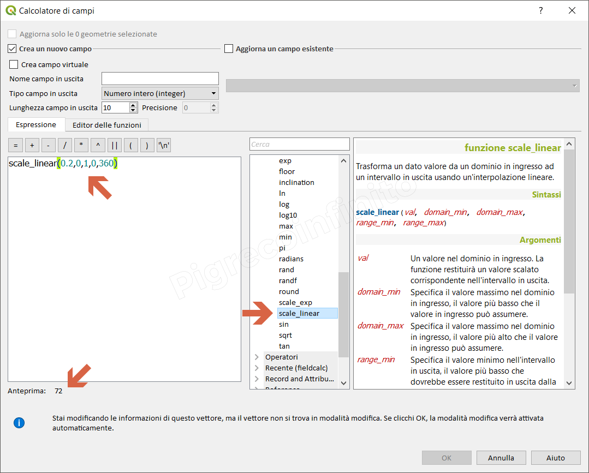

# scale_linear

Trasforma un dato valore da un dominio in ingresso ad un intervallo in uscita usando un'interpolazione lineare.

## Sintassi

scale_linear(_val, domain_min, domain_max, range_min, range_max_)

## Argomenti

* _val_ Un valore nel dominio in ingresso. La funzione restituirà un valore scalato corrispondente nell'intervallo in uscita.
* _domain_min_ Specifica il valore massimo nel dominio in ingresso, il valore più basso che il valore in ingresso può assumere.
* _domain_max_ Specifica il valore massimo nel dominio in ingresso, il valore più alto che il valore in ingresso può assumere.
* _range_min_ Specifica il valore minimo nell'intervallo in uscita, il valore più basso che dovrebbe essere restituito in uscita dalla funzione.
* _range_max_ Specifica il valore massimo nell'intervallo di uscita, il valore più alto che dovrebbe essere restituito dalla funzione.

## Esempi

* `scale_linear(5,0,10,0,100) → 72`
* `scale_linear(0.2,0,1,0,360) → 72 (per scalare un valore tra 0 e 1 in un angolo tra 0 e 360)`
* `scale_linear(1500,1000,10000,9,20) → 10.22 (per scalare una popolazione che varia tra 1000 e 10000 in una dimensione del carattere tra 9 e 20)`

## nota bene

--

## osservazioni

--
