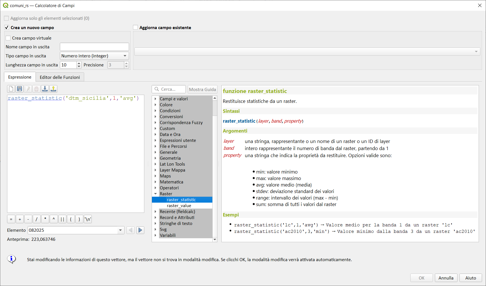
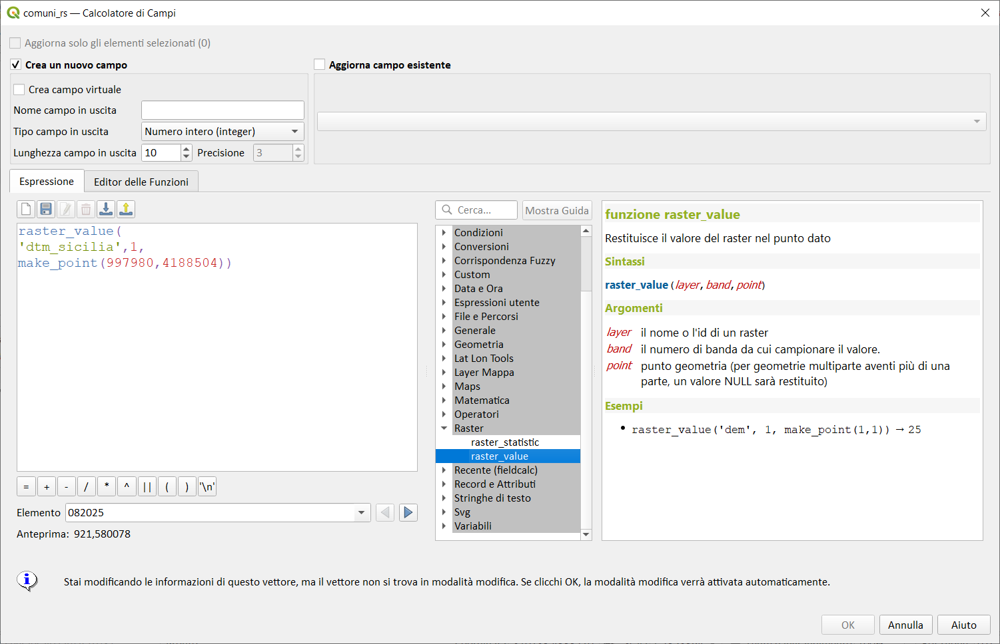
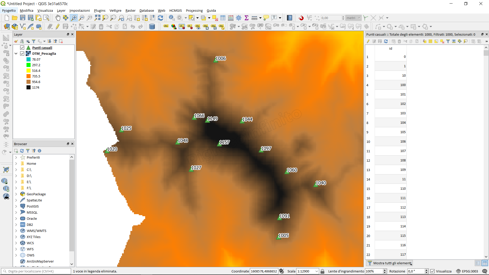
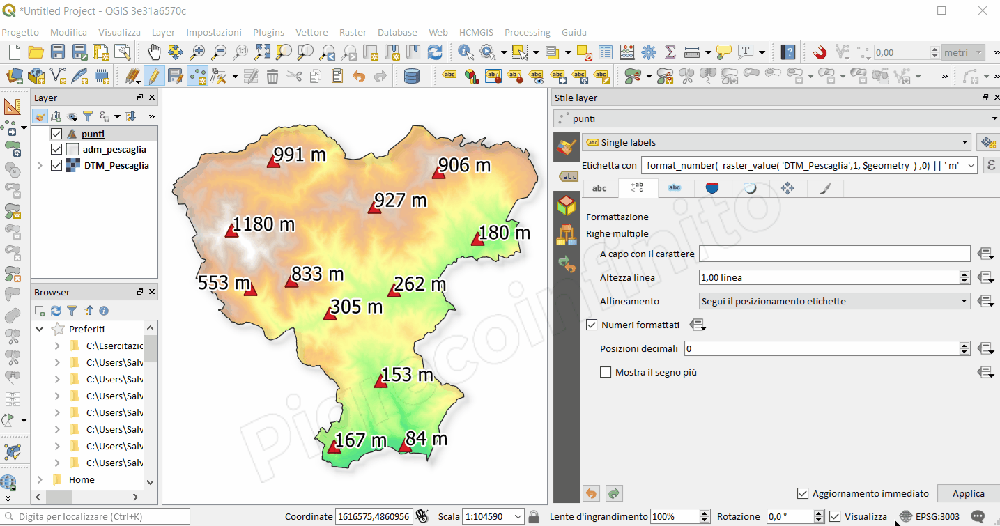
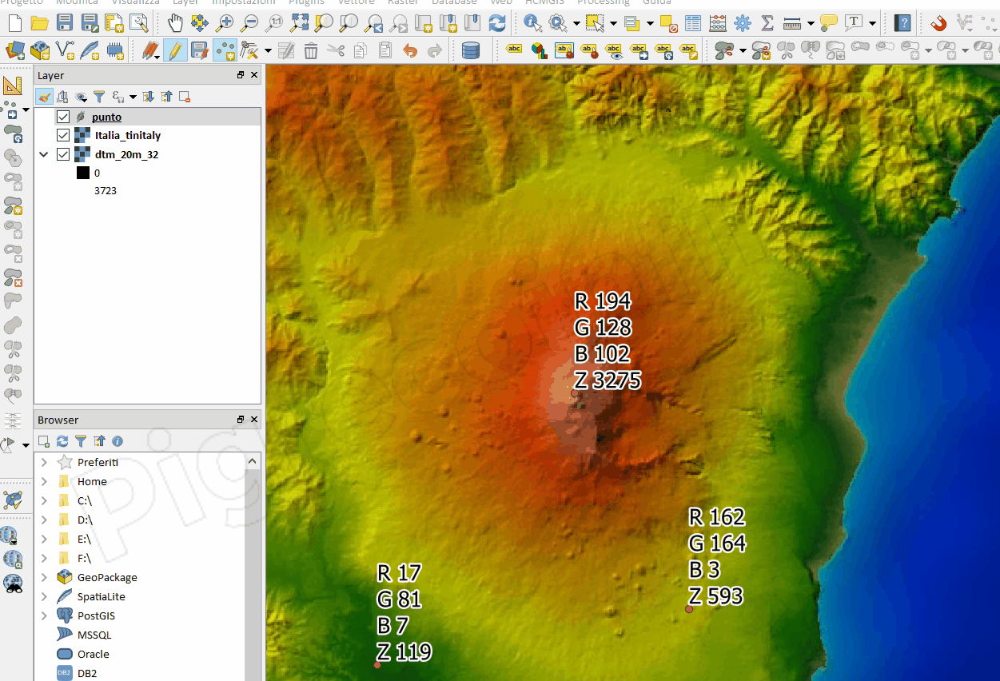

# Gruppo Raster

!!! Abstract
    **Contiene funzioni che calcolano statistiche e valori raster.**

---

## raster_statistic

Restituisce statistiche da un raster.

Sintassi:

* raster_statistic(*<span style="color:red;">layer</span>, <span style="color:red;">band</span>, <span style="color:red;">property</span>*)

Argomento:

* *<span style="color:red;">layer</span>* una stringa, rappresentante o un nome di un raster o un ID di layer
* *<span style="color:red;">band</span>* intero rappresentante il numero di banda dal raster, partendo da 1
* *<span style="color:red;">property</span>* una stringa che indica la proprietà da restituire. Opzioni valide sono:

    - *min*: valore minimo
    - *max*: valore massimo
    - *avg*: valore medio (media)
    - *stdev*: deviazione standard dei valori
    - *range*: intervallo dei valori (max - min)
    - *sum*: somma di tutti i valori dal raster

Esempi:

```
raster_statistic('lc',1,'avg') → Valore medio per la banda 1 da un raster layer 'lc'
raster_statistic('ac2010',3,'min') → Valore minimo dalla banda 3 da un layer raster 'ac2010'
raster_statistic( 'sicilia_dtm40',1,'max') → valore massimo del DTM
```



Nota bene

Queste statistiche sono riferite sempre a tutto il raster anche se la geometria è più o meno estesa del raster. Nel caso che segue ho popolato il campo _raster_ del vettore punto con il valore _max_ dell'intero DTM


---

## raster_value

Restituisce il valore raster trovato nel punto fornito. <span style="color:red;">NOVITÀ QGIS 3.4 OTTOBRE 2018</span>

Sintassi:

* raster_value(_<span style="color:red;">layer</span>,<span style="color:red;">band</span>,<span style="color:red;">point</span>_)

Argomento:

* *<span style="color:red;">layer</span>* il nome o l'id di un layer raster
* *<span style="color:red;">band</span>* il numero della banda da cui campionare il valore
* *<span style="color:red;">point</span>* geometria del punto (per geometrie multiparte aventi più di una parte, verrà restituito un valore nullo)

Esempi:

```
raster_value( 'DTM_Pescaglia',1,$geometry) → 631.2899169921875
```



Nota bene

Esempi:



Animazione



**raster_value()** con più bande e più layer



espressione usata:
```
'R ' ||  raster_value( 'Italia_tinitaly',1, $geometry  ) 
|| '-' || 
'G ' || raster_value( 'Italia_tinitaly',2, $geometry  ) 
|| '-' || 
'B '  || raster_value( 'Italia_tinitaly',3, $geometry  ) 
|| '-' || 
'Z '  || raster_value( 'dtm_20m_32',1, $geometry  ) 
```

Video demo

[](https://www.youtube.com/watch?v=lfb2DNm5Bjs&t= "Esepio d'uso")
