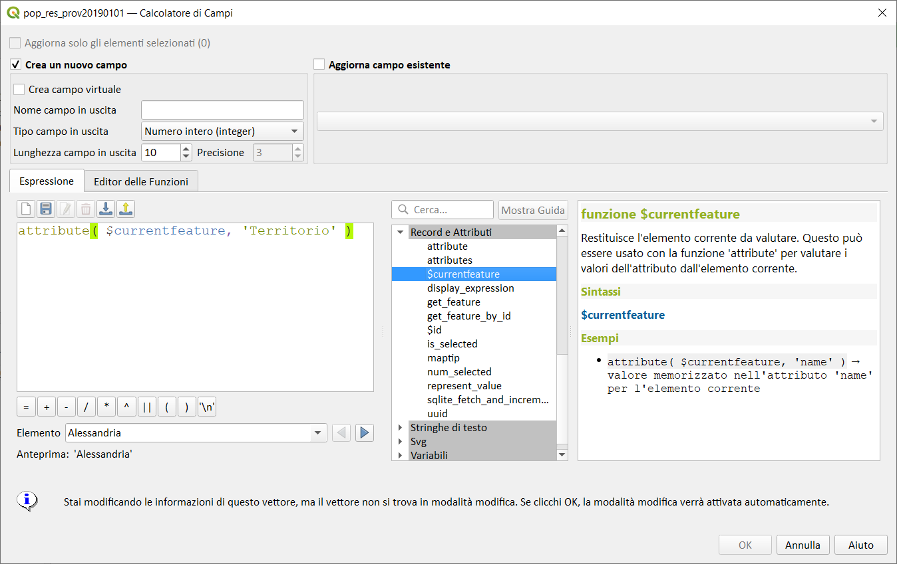
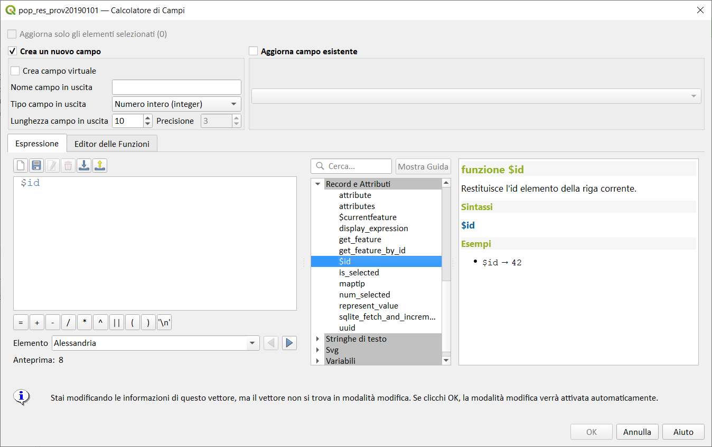
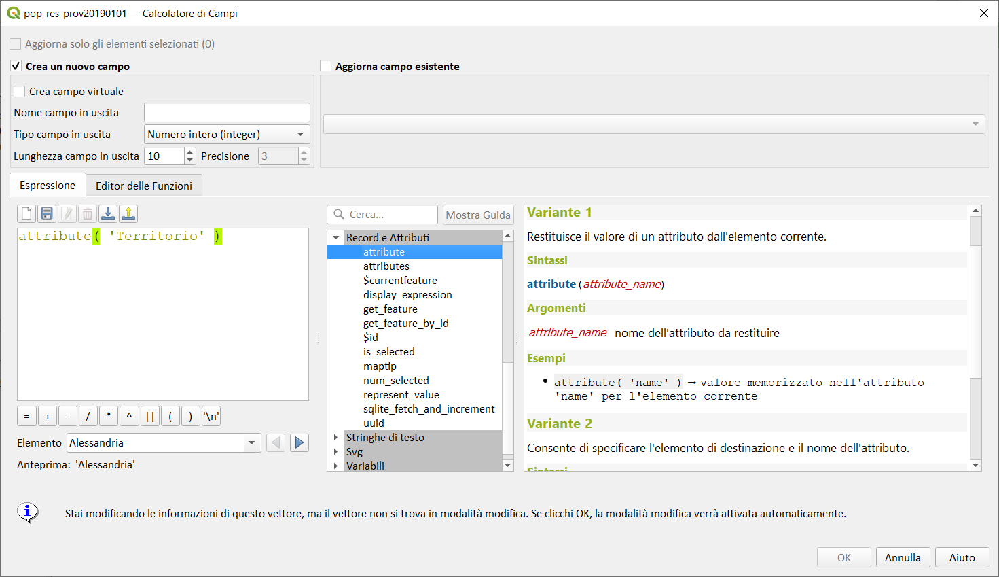
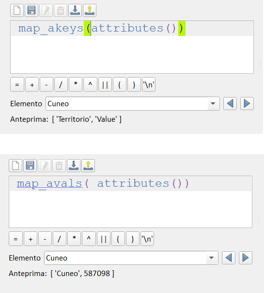
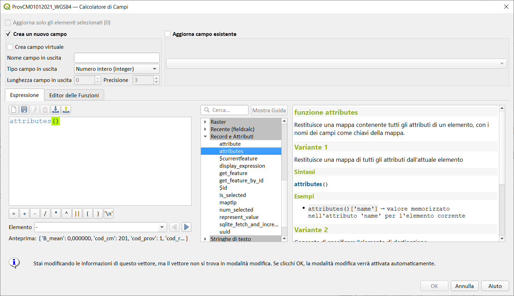
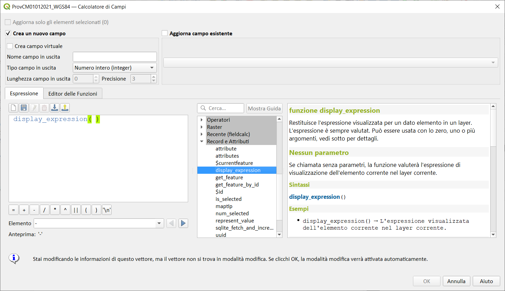

# Gruppo Record e Attributi

!!! Abstract
    **Questo gruppo contiene funzioni che operano sugli identificativi dei record.**

---

## $currentfeature

Restituisce l'elemento corrente corrente da valutare. Questo può essere usato con la funzione 'attribute' per valutare i valori dell'attributo dall'elemento corrente.

Sintassi:

* $currentfeature

Esempi:

```
attribute( $currentfeature, 'name' ) → valore memorizzato nell'attributo 'name' per l'elemento corrente
```

[](../../img/record_e_attributi/$currentfeature1.png)

---

## $id

Restituisce l'id geometria della riga corrente.

Sintassi:

* $id

Esempi:

```
$id → 71
```

Osservazioni:

Questa funzione inizia sempre da 0 con vettore shapefile da 1 con i database

[](../../img/record_e_attributi/$id1.png)

---

## attribute

Restituisce un attributo da un elemento.

### Variante 1

Restituisce il valore di un attributo dall'elemento corrente.

Sintassi:

- attribute(_<span style="color:red;">attribute_name</span>_)

Argomenti:

- _<span style="color:red;">attribute_name</span>_ nome dell'attributo da restituire

Esempi:

```
attribute( 'name' ) → valore memorizzato nell'attributo 'name' per l'elemento corrente
```

### Variante 2

Consente di specificare l'elemento di destinazione e il nome dell'attributo.

Sintassi:

* attribute(*<span style="color:red;">feature</span>, <span style="color:red;">attribute_name</span>*)

Argomenti:

* *<span style="color:red;">feature</span>* un elemento
* *<span style="color:red;">attribute_name</span>* nome dell'attributo da restituire

Esempi:

```
attribute( $currentfeature, 'name' ) → valore memorizzato nell'attributo 'name' per l'elemento corrente
```

[](../../img/record_e_attributi/attribute1.png)

---

## attributes

Restituisce una mappa contenente tutti gli attributi di un elemento, con i nomi dei campi come chiavi della mappa.

### Variante 1

Restituisce una mappa di tutti gli attributi dall'attuale elemento.

Sintassi:

- _attributes()_

Esempi:o

```
attributes()['name'] → valore memorizzato nell'attributo 'name' per l'elemento corrente
```

per trasformare una feature (una riga di una tabella) in un array:

[](../../img/record_e_attributi/attributes2.png)

### Variante 2

Consente di specificare la feature di destinazione.

Sintassi:

- attributes(_<span style="color:red;">feature</span>_)

Argomenti:

- _<span style="color:red;">feature</span>_ un elemento

Esempi:

```
attributes( @atlas_feature )['name'] → valore memorizzato nell'attributo 'name' per l'elemento corrente dell'atlante
```

[](../../img/record_e_attributi/attributes1.png)

---

## display_expression

Restituisce l'espressione visualizzata per un dato elemento in un layer. L'espressione è sempre valutata. Può essere usata con lo zero, uno o più argomenti, vedi sotto per dettagli.

### Nessun parametro

Se chiamata senza parametri, la funzione valuterà l'espressione di visualizzazione dell'elemento corrente nel layer corrente.

Sintassi:

- display_expression()

Esempi:

```
display_expression() → L'espressione visualizzata dell'elemento corrente nel layer corrente
```

### Un parametro 'feature'

Se chiamata con il solo parametro 'feature', la funzione valuterà l'elemento specificato nel layer corrente.

Sintassi:

- display_expression(_<span style="color:red;">feature</span>_)

Argomenti:

- _<span style="color:red;">feature</span>_ L'elemento che dovrebbe essere valutato.

Esempi:

```
display_expression(@atlas_feature) → L'espressione visualizzata dell'elemento corrente dell'atlante.
```

### Parametri del Layer ed elementi

Se la funzione viene chiamata sia con un layer che con un elemento, valuterà l'elemento specificato dal layer indicato.

Sintassi:

- display_expression(_<span style="color:red;">layer</span>_,_<span style="color:red;">feature</span>_[,_<span style="color:red;">evaluate=true</span>_])

[ ] indica componenti opzionali

Argomenti:

- _<span style="color:red;">layer</span>_ Il layer (o suo ID o nome)
- _<span style="color:red;">feature</span>_ L'elemento che dovrebbe essere valutato.
- _<span style="color:red;">evaluate</span>_ Se l'espressione deve essere valutata. Se false l'espressione sarà restituita solo come stringa letterale (che potenzialmente potrebbe essere valutata a posteriori tramite la funzione 'eval'). 

Esempi:

```
display_expression( 'streets', get_feature_by_id('streets', 1)) → L'espressione visualizzata dell'elemento con ID 1 sul layer 'streets'.
display_expression('a_layer_id', $currentfeature, 'False') → L'espressione visualizzata del dato elemento non è stata valutata.
```
[](../../img/record_e_attributi/display_expression1.png)

---

## get_feature

Restituisce il primo elemento di un layer che corrisponde ad un dato valore di attributo.

### Variante a valore singolo

Insieme all'ID livello, vengono specificati una singola colonna e un valore.

Sintassi:

* get_feature(*<span style="color:red;">layer</span>, <span style="color:red;">attribute</span>, <span style="color:red;">value</span>*)

Argomenti:

* *<span style="color:red;">layer</span>* nome layer o ID
* *<span style="color:red;">attribute</span>* nome attributo
* *<span style="color:red;">value</span>* valore attributo da far corrispondere

Esempi:

```
get_feature('streets','name','main st') → prima geometria trovata nel vettore "streets" con valore "main st" nel campo "name"
get_feature( 'streets', 'fid', attribute( $currentfeature, 'name') ) → Restituisce la prima feature nel layer "streets" il cui campo "fid" ha lo stesso valore del campo "nome" della feature corrente` (una sorta di JOIN)
```

[](../../img/record_e_attributi/get_feature1.png)

### Variante map

**QGIS** >= 3.24

Insieme all'ID livello, una mappa contenente le colonne (chiave) e il rispettivo valore da utilizzare.

Sintassi:

* get_feature(*<span style="color:red;">layer</span>, <span style="color:red;">map</span>*)

Argomenti:

* *<span style="color:red;">layer</span>* nome layer o ID
* *<span style="color:red;">map</span>* Mappa contenente le coppie di colonne e valori da usare.

Esempi:

```
get_feature('streets',map('name','main st','lane_num','4')) → primo elemento trovato in 'streets' con il valore 'main st' nel campo 'name' e il valore '4' nel campo 'lane_num'
```

[](../../img/record_e_attributi/get_feature_02.png)

---

## get_feature_by_id

Restituisce l'id dell'elemento della riga corrente.

Sintassi:

* get_feature_by_id(*<span style="color:red;">layer</span>, <span style="color:red;">feature_id</span>*)

Argomenti:

* *<span style="color:red;">layer</span>* layer, nome del layer o id del layer
* *<span style="color:red;">feature_id</span>* L'id dell'elemento che deve essere restituito (inizia da 0 per gli shapefile)

Esempi:

```
get_feature_by_id('streets', 1) → l'elemento con id 1 nel vettore "streets"
```


[](../../img/record_e_attributi/get_feature_by_id1.png)

---

## is_selected

Restituisce Vero se è selezionata una funzione. Può essere usato con zero, uno o due argomenti, vedi sotto per i dettagli.

### Senza parametri

Se chiamata senza parametri, la funzione restituirà vero se è selezionata la feature corrente nel layer corrente.

Sintassi:

- is_selected()

Esempi:

```
is_selected() → True (vero) se l'elemento corrente è selezionato.
```

### Una Feature come parametro

Se chiamata con il solo parametro 'feature', la funzione restituisce true se l'elemento specificato è selezionato nel layer attuale.

Sintassi:

* is_selected(*<span style="color:red;">feature</span>*)

Argomenti:

* *<span style="color:red;">feature</span>* L'elemento che deve essere controllata per la selezione.

Esempi:

```
is_selected(@atlas_feature) → Vero se l'elemento corrente dell'atlante è selezionato.
is_selected(get_feature('streets', 'name', 'Main St.'))) → Vero se l'unico elemento con nome "Main St." sul layer "streets" attivo è selezionato.
is_selected(get_feature_by_id('streets', 1)) → Vero se l'elemento con l'ID 1 sul layer "streets" attivo è selezionato.
```

### Due parametri

Se la funzione è chiamata sia con un layer che con un elemento, questa restituirà vero se l'elemento specificato del layer specificato è selezionato.

Sintassi:

* is_selected(*<span style="color:red;">layer</span>, <span style="color:red;">feature</span>*)

Argomenti:

* _<span style="color:red;">layer</span>_ Il layer (o il suo ID o nome) su cui verrà controllata la selezione.
* _<span style="color:red;">feature</span>_ L'elemento che deve essere controllato per la selezione.

Esempi:

```
is_selected( 'streets', get_feature('streets', 'name', "street_name")) → Vero se è selezionata la strada dell'edificio corrente (supponendo che il layer edifici abbia un campo denominato 'street_name' e il layer strade abbia un campo denominato 'name' con valori univoci).
is_selected( 'streets', get_feature_by_id('streets', 1)) → Vero se l'elemento con l'ID 1 nel layer "streets" è selezionato.
```

[](../../img/record_e_attributi/is_selected0.png)

Esempio etichettatura tramite regola:

[](../../img/record_e_attributi/is_selected1.gif)

Esempio tematizzazione tramite regola:

[](../../img/record_e_attributi/is_selected3.png)

[](../../img/record_e_attributi/is_selected2.gif)

---

## maptip

Restituisce il suggerimento mappa di un dato elemento in un vettore. Per impostazione predefinita, l'espressione è valutata. Può essere usata con zero, uno o più argomenti, vedi sotto per dettagli.

### Nessun parametro

Se chiamata senza parametri, la funzione valuterà il suggerimento mappa dell'elemento corrente nel layer corrente.

Sintassi:

- maptip()

Esempi:

```
maptip() → Il suggerimento mappa dell'elemento corrente nel layer corrente.
```

### Un parametro 'feature'

Se chiamata con il solo parametro 'feature ', la funzione valuterà l'elemento specificato nel layer corrente.

Sintassi:

- maptip(_<span style="color:red;">feature</span>_)

Argomenti:

- _<span style="color:red;">feature</span>_ L'elemento che dovrebbe essere valutato.

Esempi:

```
maptip(@atlas_feature) → Il suggerimento mappa dell'elemento corrente dell'atlante.
```

### Parametri del Layer ed elementi

Se la funzione viene chiamata sia con un layer che con un elemento, valuterà l'elemento specificato dal layer indicato.

Sintassi:

- maptip(_<span style="color:red;">layer</span>_,_<span style="color:red;">feature</span>_[,_<span style="color:red;">evaluate=true</span>_])

[ ] indica componenti opzionali

Argomenti:

- _<span style="color:red;">layer</span>_ Il layer (o suo ID o nome)
- _<span style="color:red;">feature</span>_ L'elemento che dovrebbe essere valutato.
- _<span style="color:red;">evaluate</span>_ Se l'espressione deve essere valutata. Se false l'espressione sarà restituita solo come stringa letterale (che potenzialmente potrebbe essere valutata a posteriori tramite la funzione 'eval_template').  

Esempi:

```
maptip('streets', get_feature_by_id('streets', 1)) → Il suggerimento mappa dell'elemento con ID 1 sul vettore 'streets'.
maptip('a_layer_id', $currentfeature, 'False') → Il suggerimento mappa del dato elemento non valutato.
```

[](../../img/record_e_attributi/maptip1.png)

---

## num_selected

Restituisce il numero di geometrie selezionate in un vettore dato. Per impostazione predefinita funziona sul vettore sul quale l'espressione è valutata.

Sintassi:

* num_selected([*<span style="color:red;">layer=current layer</span>*])

Argomenti:

* *<span style="color:red;">layer</span>* Il vettore (o il suo id o nome) sul quale la selezione sarà controllata.

Esempi:

```
num_selected() → Il numero di geometrie selezionate nel vettore corrente.
num_selected('streets') → Il numero di geometrie selezionate nel vettore streets
```

[](../../img/record_e_attributi/num_selected1.png)

---

## represent_attributes

Restituisce una mappa con i nomi degli attributi come chiavi ed i valori di rappresentazione configurati come valori. Il valore di rappresentazione per gli attributi dipende dal tipo di widget configurato per ogni attributo. Può essere usato con zero, uno o più argomenti, vedi sotto per i dettagli.

### Nessun paramentro

Se chiamata senza parametri, la funzione restituisce la rappresentazione degli attributi dell'elemento corrente nel layer corrente.

Sintassi:

- represent_attributes()

Esempio:

```
represent_attributes() → La rappresentazione degli attributi per l'elemento corrente.
```

[](../../img/record_e_attributi/represent_attributes_01.png)

### Un parametro feature

Se chiamata solo con un parametro 'feature', la funzione restituisce la rappresentazione degli attributi dell'elemento specificato dal layer corrente.

Sintassi:

- represent_attributes(_<span style="color:red;">feature</span>_)

Argomenti:

* _<span style="color:red;">feature</span>_ L'elemento che dovrebbe essere valutato

Esempio:

```
represent_attributes($currentfeature) → La rappresentazione degli attributi per l'elemento corrente.
```

[](../../img/record_e_attributi/represent_attributes_02.png)

### Parametri layer e feature

Se chiamata con un parametro 'layer' e un parametro 'feature', la funzione restituirà la rappresentazione degli attributi dell'elemento specificato dal layer specificato

Sintassi:

- represent_attributes(_<span style="color:red;">layer</span>_, _<span style="color:red;">feature</span>_)

Argomenti:

*  _<span style="color:red;">layer</span>_ Il layer (o suo ID o nome).
* _<span style="color:red;">feature</span>_ L'elemento che dovrebbe essere valutato

Esempio:

```
represent_attributes(@layer, $currentfeature) → La rappresentazione degli attributi per l'elemento corrente.
```

[](../../img/record_e_attributi/represent_attributes_03.png)

---

## represent_value

Restituisce il metodo di rappresentazione configurato per un valore di un campo. Esso dipende dal tipo di widget configurato. Spesso, questo è molto utile per i widget 'Mappa Valore'.

Sintassi:

* represent_value(*<span style="color:red;">value</span>, <span style="color:red;">fieldName</span>*)

Argomenti:

* *<span style="color:red;">value</span>* Il valore che dovrebbe essere risolto. Molto probabilmente un campo.
* *<span style="color:red;">fieldName</span>* Il nome del campo per cui la configurazione del widget dovrebbe essere caricata. (Opzionale)

Esempi:

```
represent_value("field_with_value_map") → Descrizione per il valore
represent_value('static value', 'field_name') → Descrizione per il valore statico
```

[](../../img/record_e_attributi/represent_value1.png)

---

## sqlite_fetch_and_increment

Gestisce i valori incrementali nei database sqlite.

I valori predefiniti in SQlite possono essere applicati all'inserimento e non possono venir elaborati con il prefetch.

Ciò rende impossibile l'acquisizione e l'incremento della chiave primaria tramite l'AUTO_INCREMENT prima della creazione della riga nel database. Note a margine: con postgres, questo funziona tramite l'opzione valuta i valori predefiniti.

Quando vengono aggiunti nuovi elementi che hanno relazioni, è veramente grazioso poter aggiungere elementi figlio per un genitore, mentre il modulo dei genitori è ancora aperto e l'elemento genitore non è ancora salvato.

Per sorpassare questa limitazione, questa funzione può essere usata per gestire valori sequenziali in una tabella separata basata su un formato sqlite come il gpkg.

La tabella sequenza sarà filtrata per un id sequenziale (filter_attribute e filter_value) ed il valore attuale dell'id_field sarà incrementato di 1 e verrà restituto il valore incrementato.

Se colonne aggiuntive richiedono che per esse debbano venir specificati valori, i default_values map possono essere usati per questo scopo.

### Nota

Questa funzione modifica la tabella sqlite di destinazione. Essa è intesa per l'uso con la configurazione predefinita per gli attributi.
Quando il parametro è un layer ed il layer è in modo transazione, il valore viene recuperato solo una volta durante il tempo di vita di una transazione e memorizzato ed incrementato. Ciò rende insicuro lavorare sullo stesso database con diversi processi in parallelo.

Sintassi:

- sqlite_fetch_and_increment(_<span style="color:red;">database</span>_,_<span style="color:red;">table</span>_,_<span style="color:red;">id_field</span>_,_<span style="color:red;">filter_attribute</span>_,_<span style="color:red;">filter_value</span>_[,_<span style="color:red;">default_values</span>_])

[ ] indica componenti opzionali

Argomenti:

- _<span style="color:red;">database</span>_ Percorso del file sqlite o del layer geopackage
- _<span style="color:red;">table</span>_ Nome della tabella che gestisce le sequenze
- _<span style="color:red;">id_field</span>_ Nome del campo che contiene il valore corrente
- _<span style="color:red;">filter_attribute</span>_ Nome del campo che contiene un identificatore unico per questa sequenza. Deve avere un indice di tipo UNIQUE.
- _<span style="color:red;">filter_value</span>_ Nome della sequenza da utilizzare.
- _<span style="color:red;">default_values</span>_ Compila con i valori predefiniti per campi aggiuntivi sulla tabella. I valori necessitano di essere quotati. Sono consentite le funzioni.

Esempi:

```
sqlite_fetch_and_increment(@layer, 'sequence_table', 'last_unique_id', 'sequence_id', 'global', map('last_change', 'date(''now'')', 'user', '''' || @user_account_name || '''')) → 0
sqlite_fetch_and_increment(layer_property(@layer, 'path'), 'sequence_table', 'last_unique_id', 'sequence_id', 'global', map('last_change', 'date(''now'')', 'user', '''' || @user_account_name || '''')) → 0
```

[](../../img/record_e_attributi/sqlite_fetch_and_increment1.png)

---

## uuid

Genera un Universally Unique Identifier (UUID) per ciascun record usando il metodo Qt [QUuid::createUuid](https://doc.qt.io/qt-5/quuid.html#createUuid). Aggiornato dalla QGIS 3.18

Sintassi:

* uuid([_<span style="color:red;">format='WithBraces'</span>_])

[ ] indica componenti opzionali

Argomenti:

- _<span style="color:red;">format</span>_ Il formato, come l'UUID verrà formattato. 'WithBraces' (con parentesi {}), 'WithoutBraces' (senza parentesi) o 'Id128' (senza trattino).


Esempi:

```
uuid() → '{0bd2f60f-f157-4a6d-96af-d4ba4cb366a1}'
uuid('WithoutBraces') → '0bd2f60f-f157-4a6d-96af-d4ba4cb366a1'
uuid('Id128') → '0bd2f60ff1574a6d96afd4ba4cb366a1'
```

[1.png)]()1.png)

---
