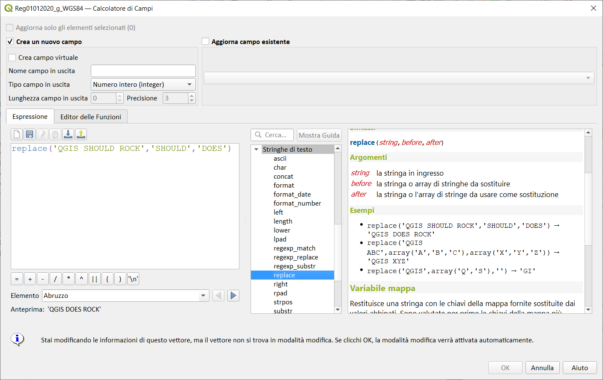
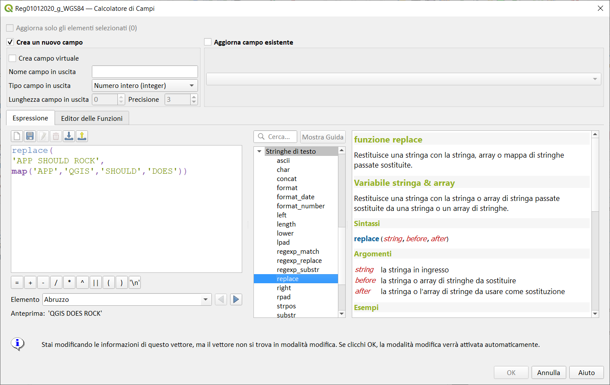

# replace

Restituisce una stringa con la stringa, array o mappa di stringhe passate sostituite.

## Variabile stringa & array
Restituisce una stringa con la stringa o array di stringa passate sostituite da una stringa o un array di stringhe.

## Sintassi

replace(_string, before, after_)

## Argomenti

* _string_ la stringa in ingresso
* _before_ la stringa o array di stringhe da sostituire
* _after_ la stringa o l'array di stringe da usare come sostituzione

## Esempi

* `replace('QGIS SHOULD ROCK','SHOULD','DOES') → 'QGIS DOES ROCK'`
* `replace('QGIS ABC',array('A','B','C'),array('X','Y','Z')) → 'QGIS XYZ'`
* `replace('QGIS',array('Q','S'),'') → 'GI'`

## Variabile mappa

Restituisce una stringa con le chiavi mappa fornite sostituite da valori accoppiati.

## Sintassi
replace(_string, map_)

## Argomenti

* _string_ la stringa in ingresso
* _map_ la mappa che contiene le chiavi e i valori

## Esempi

* `replace('APP SHOULD ROCK',map('APP','QGIS','SHOULD','DOES')) → 'QGIS DOES ROCK'`

## nota bene

--

## osservazioni

--
